[README (ENG)](README.md) / [README (한국어)](README_KO.md)

# FEMTOCAM

  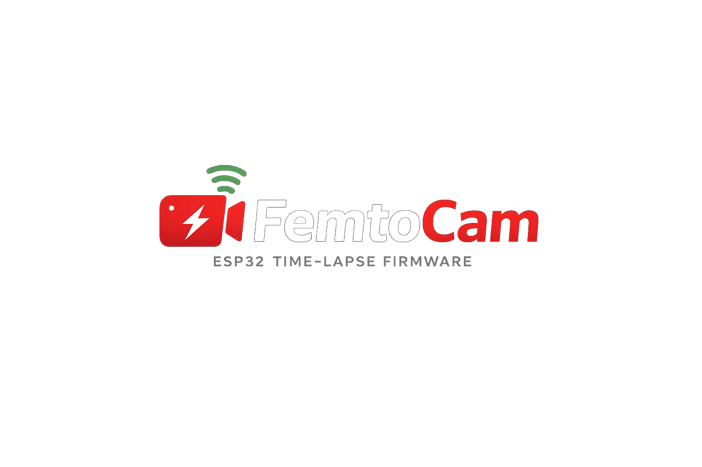

  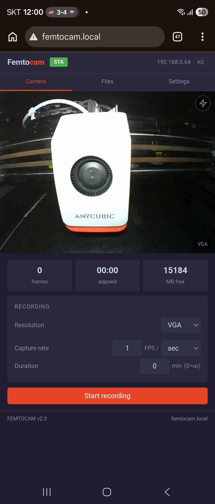
  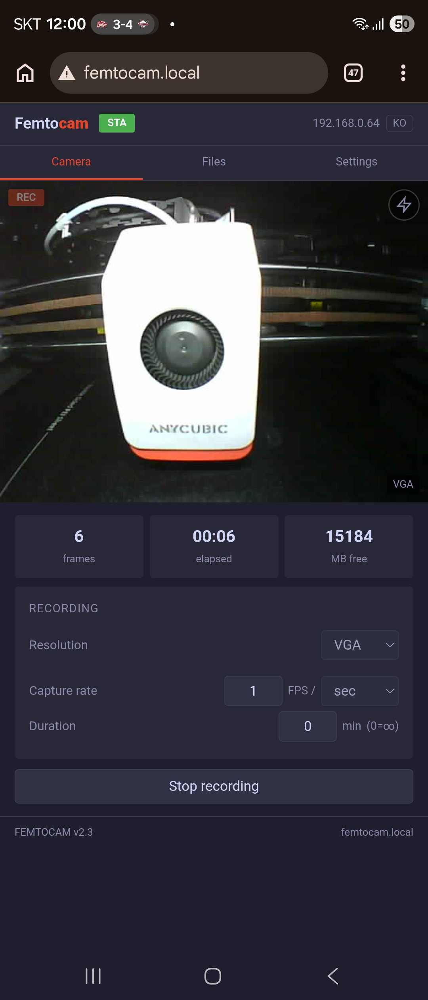
  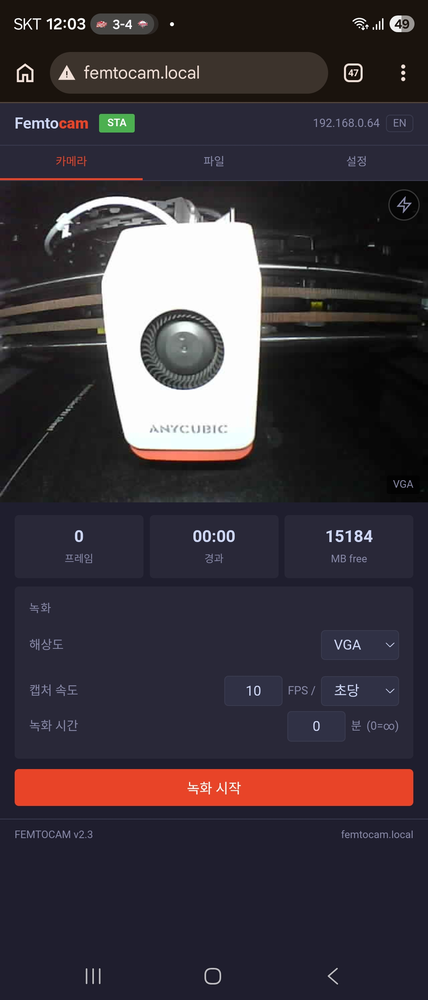

---

## What is FEMTOCAM?

  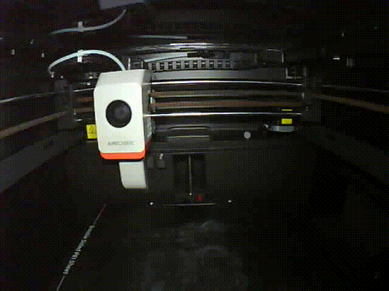

A WiFi camera module built with just an ESP32-CAM board and a MicroSD card. Open a browser, watch a live stream, record timelapses, and manage files — all from your phone or PC.

- **Live streaming** — MJPEG at QVGA / VGA / SVGA
- **Timelapse recording** — Freely set capture rate per second / minute / hour, with separate playback FPS
- **Continuous recording** — 1–24fps, duration timer, power-loss protection
- **File management** — Multi-select, batch download/delete, inline rename
- **Auto WiFi setup** — Creates open AP on first boot, configure via browser, mDNS support
- **Dark theme web UI** — Mainsail-inspired, English/Korean
- **Zero external libraries** — Only Arduino core and ESP-IDF

Access: `http://femtocam.local/` or `http://192.168.4.1/`

---

## Wait, what's FEMTO?

**FEMTO** is a budget 3D printer building competition held by the [DCinside 3D Printing Minor Gallery](https://gall.dcinside.com/mgallery/board/lists/?id=3dprinting), a Korean 3D printing community.

There was once a printer sold in Korea under the name "Sondori Pico" (an Easythreed rebrand). Its quality was so toy-like that it became a meme — whenever someone called a printer cheap, the community would say "at least it's better than Pico."

  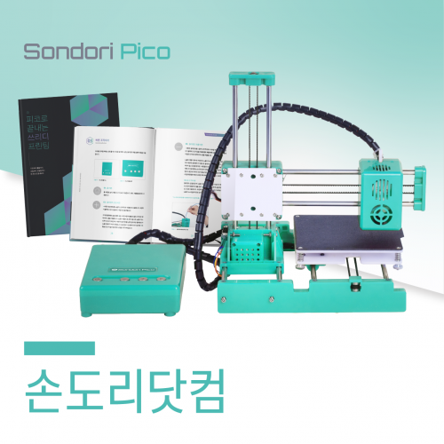 
  The legendary Sondori Pico

FEMTO pays homage to that Pico — the challenge is to build a printer that's **even cheaper than Pico, but actually works**. The name comes from the SI prefix: Pico is 10⁻¹², Femto is 10⁻¹⁵. Smaller, cheaper, yet functional.

### FEMTO Family

Developed for the FEMTO competition, but each module works as a standalone unit with any 3D printer — or anything else, really.

| Project | Description | Platform | Status |
|---------|-------------|----------|--------|
| **FEMTO Nano XY** | Ultra-budget DIY 3D printer (competition entry) | Marlin | In development |
| **FEMTOCAM** | Streaming & timelapse camera (this repo) | ESP32-CAM | Released |
| **FEMTO Shaper** | Standalone input shaping module | ESP32-C3 + ADXL345 | In development |

---

## Why build this?

The goal of FEMTO is an ultra-budget printer. Using Klipper would require an SBC like a Raspberry Pi, and that alone could blow the budget. So **Marlin** was the obvious choice — one mainboard, no SBC.

But Marlin has a gap: there's no built-in camera streaming or timelapse recording. With Klipper + Mainsail, you get that for free through the SBC. With Marlin, there's nowhere to plug in a camera. And recording timelapses isn't a luxury — it's how you catch failed prints and document your work.

So the plan became: **build a standalone camera module with ESP32-CAM.**

ESP32-CAM does come with Espressif's example sketch. But if you've used it, you know — the settings screen is overwhelming, the UI is bare-bones, and there's no recording. It certainly doesn't look like it belongs next to a Mainsail dashboard.

FEMTOCAM started from that example and:

1. **Simplified** — Cleaned up the settings, added tooltips for every option
2. **Added timelapse** — Separate capture rate and playback FPS for proper timelapses
3. **Added file management** — Download, delete, and rename recordings from the browser
4. **Redesigned** — Mainsail-inspired dark theme that feels at home next to your printer

The result: zero external libraries, 1,084 lines, a standalone module that gives Marlin printers timelapse capability without an SBC.

---

## Screenshots

### STA Mode (WiFi connected)

| Camera | Files | Settings |
|:---:|:---:|:---:|
|  | 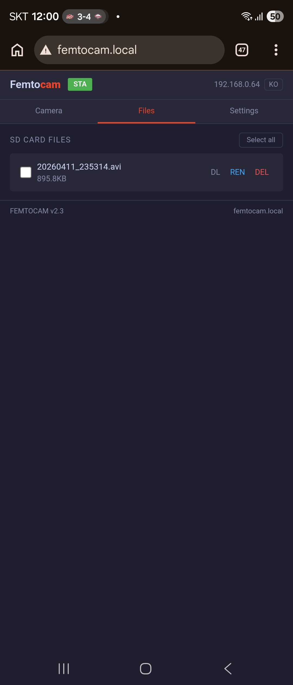 | 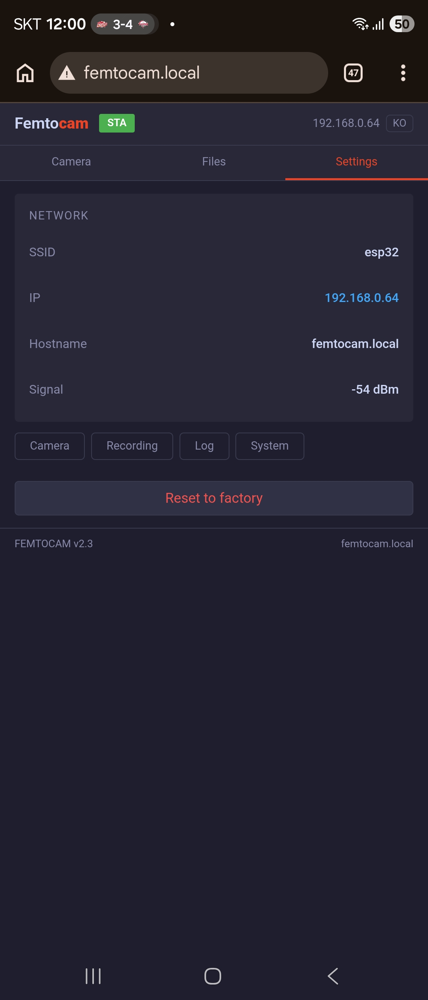 |
| Live stream & recording controls | NTP-based filenames, DL/REN/DEL | Network info, 4 settings sections |

### Recording & Korean

| Recording | Korean mode |
|:---:|:---:|
|  |  |
| REC badge, frame counter, elapsed time | Toggle language with KO/EN button |

### AP Mode (First boot)

| AP Camera | WiFi Setup | WiFi Scan |
|:---:|:---:|:---:|
| 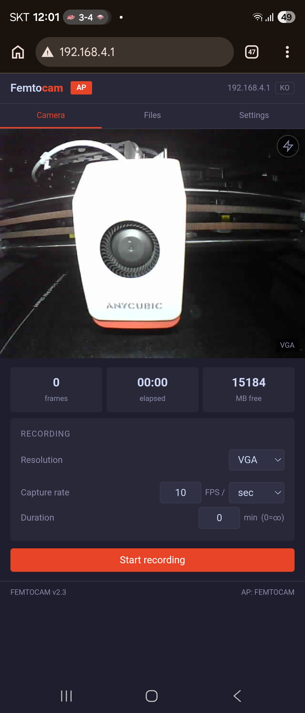 | 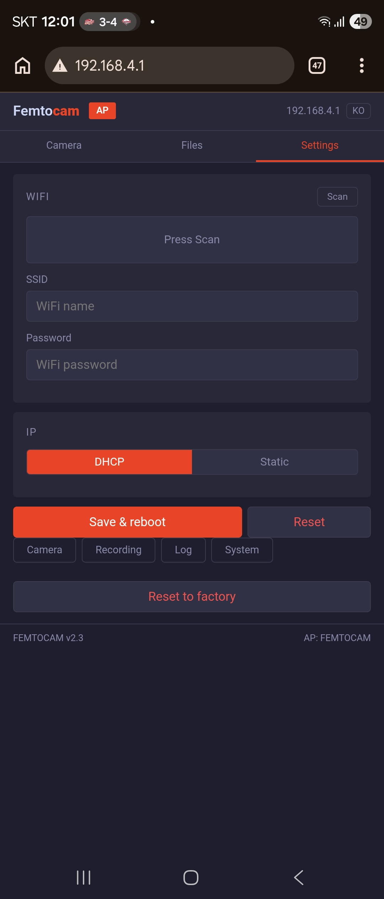 | 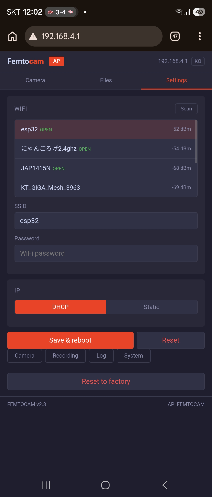 |
| Connect to 192.168.4.1, AP badge | Scan → enter SSID/PW → Save & reboot | Nearby networks with OPEN indicator |

---

## Features in Detail

### Streaming
- MJPEG live streaming (QVGA / VGA / SVGA)
- Raw socket transfer + 4KB chunking for stable VGA streaming
- Auto-reconnect on stream drop

### Recording
- Capture rate: `[number] FPS / [per sec · per min · per hour]` free input
- Playback FPS: independent from capture — 1 frame/min capture → 15fps playback = finished timelapse
- Duration timer (0–600 min, 0 = unlimited)
- AVI mid-flush — file protected up to last flush even on power loss
- NTP-based filenames (`20260409_143022.avi`) or sequential (`aprec_001.avi`)

### File Management
- Checkbox multi-select → batch download / batch delete
- Inline rename (click → type → Enter)
- Files being recorded are protected from deletion/download

### WiFi
- First boot: `FEMTOCAM` open AP auto-created
- Configure WiFi from browser → reboot → access via mDNS
- DHCP / static IP
- Disconnect → auto-reconnect → fallback to AP

### Settings (4 sections)
- **Camera** — Brightness, contrast, saturation, quality, gain, white balance, mirror/flip
- **Recording** — Playback FPS, SD min free space, fail limit, flush interval
- **Log** — Live system log viewer in browser (no serial needed)
- **System** — Device name (reflected in logo & mDNS), firmware info, factory reset

Every setting includes a one-line description for those wondering "what does this do?"

### Device Name Customization
- Change in Settings → System
- Instantly reflected in the top-left logo
- Used as mDNS address (`http://yourname.local/`)
- If the name contains "cam", that part gets accent-colored

---

## Timelapse Examples

| Use Case | Capture Rate | Playback FPS | Result |
|----------|-------------|-------------|--------|
| Long-term (construction) | 1 frame / hour | 15fps | 1 day = 1.6 sec |
| 3D print timelapse | 1 frame / min | 15fps | 1 hour = 4 sec |
| Fast timelapse | 1 frame / sec | 15fps | 15× speed |
| Real-time recording | 15fps / sec | 15fps | Normal speed |

---

## Specs

| Item | Detail |
|------|--------|
| Platform | AI Thinker ESP32-CAM |
| Code | 1,084 lines · 4 files · **zero** external libraries |
| HTTP | Web port 80 · Stream port 81 · 23 endpoints |
| Resolution | QVGA 320×240 · VGA 640×480 · SVGA 800×600 |
| Storage | MicroSD (MMC 1-bit) · MJPEG AVI |
| Language | English / Korean |

---

## Installation

### Regular Users (Recommended)

Flash pre-built firmware directly — no compiling needed.

👉 **[Easy Install Guide (ENG)](docs/INSTALL_EASY_EN.md)** · [한국어](docs/INSTALL_EASY_KO.md)

You need: **ESP32-CAM-MB** + MicroSD + USB cable

### Advanced Users

Build from source. For those who want to modify the code.

👉 **[Developer Install Guide (ENG)](docs/INSTALL_DEV_EN.md)** · [한국어](docs/INSTALL_DEV_KO.md)

You need: VS Code + PlatformIO + Git

---

## Known Limitations

- VGA/SVGA streaming may be limited to ~7fps depending on WiFi conditions
- Single streaming client at a time
- NTP time sync only in STA mode (AP mode uses sequential filenames)
- If WiFi is unstable, try disconnecting the MB dock and powering via 5V/GND pins directly

---

## Behind the Scenes

This project was built by a non-developer through **vibe coding with Claude AI**. Architecture design, firmware, web UI, and hardware debugging — the entire process was done in conversation with AI.

Tested on real ESP32-CAM hardware, but unexpected bugs may still exist. Feel free to open an issue if you find one.

---

## License

MIT License — Use, modify, and distribute freely.

Copyright (c) 2025 Gorogepapa (meph6346@gmail.com)

---

  FEMTOCAM began at the <a href="https://gall.dcinside.com/mgallery/board/lists/?id=3dprinting">DC 3D Printing Minor Gallery</a> FEMTO competition. 
  Smaller than Pico, cheaper than Pico, but actually works.

